stolen from https://sysadmin102.com/2024/03/opnsense-openvpn-instance-remote-access-ssl-tls-user-auth/

thank you [sysadmin102](sysadmin102.com), these instructions were perfect.  Everyone, go there instead of looking at this garbage.  page exists just for future reference and all my own documentation will be rewritten to the specifics of this project.

---
# OPNSense – OpenVPN Instance – Remote Access (SSL/TLS + User Auth)

March 5, 2024 Author: [sysadmin102](https://sysadmin102.com/author/sysadmin102/ "Posts by sysadmin102")

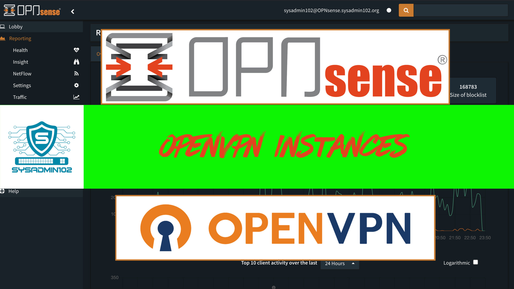

**Introduction**

The main advantages of using OpenVPN for remote access instead of IPsec are:

- Easy setup on almost all mobile clients using OPNsense’s Client Configuration Export.
- Fine-grained access control by using multiple servers or Client Specific Overrides.

Check out my YouTube channel if you prefer video content over written posts. Here’s the link to the video:

**Prerequisites**

If your internet service provider (ISP) **doesn’t provide you with a static IP address**, your IP address will change from time to time. A dynamic IP address makes it challenging to remotely access your device since the IP address keeps changing. This is where Dynamic Domain Name System (DDNS) comes in handy.

- **Dynamic DNS (DDNS)**. Follow this tutorial if you do not have a DDNS setup: [https://bit.ly/3RCeAPp](https://bit.ly/3RCeAPp)

**Step 1: Adding a Local Certificate Authority**

- The VPN server requires a certificate authority to sign client or server certificates.
- To add a new certificate authority, navigate to **System ‣ Trust ‣ Authorities** and click on **Add** in the top right corner of the form.
- To add a new certificate authority, click the ‘**Save**‘ button.

[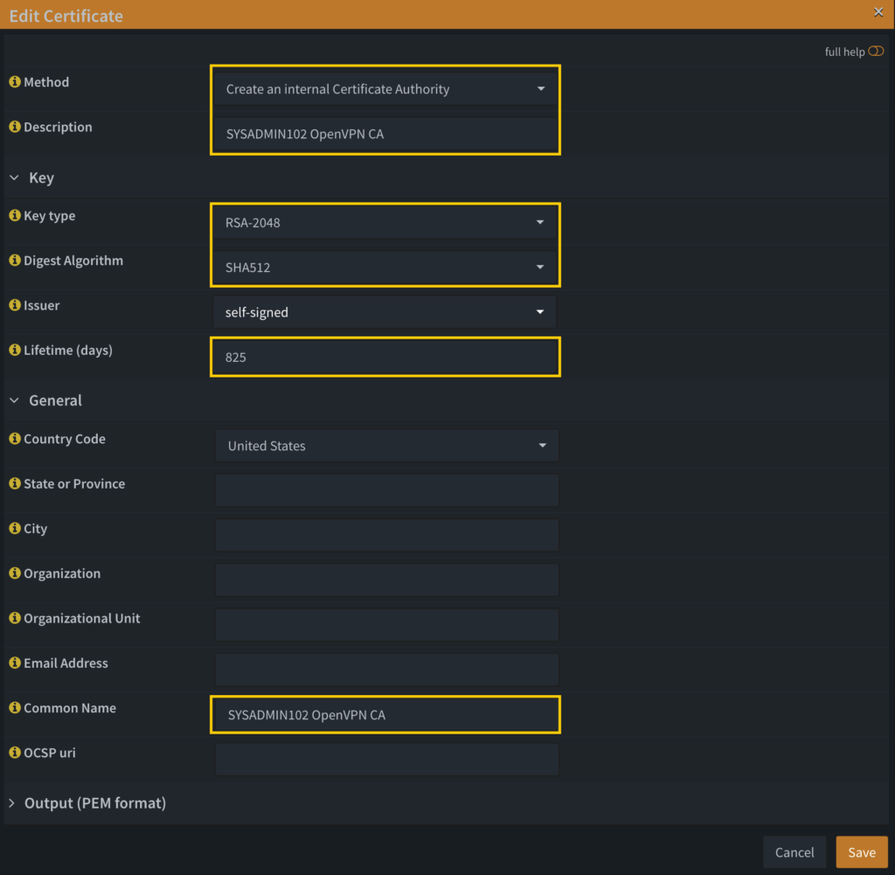](https://sysadmin102.com/wp-content/uploads/2024/03/Screenshot-2025-01-13-at-18.20.43.png)

- **Key type**: recommended RSA-2048 or higher. However, be aware that stronger encryption can use more resources and may slow down performance.
- **Digest Algorithm**: SHA512
- **Command Name**: Same as description.
- Everything else is optional.

**Step 2: Adding a Server Certificate**

After creating the Authority, we will also need a certificate. To create a new certificate, go to **System ‣ Trust ‣ Certificates** and click **Add** in the upper right corner of the form.

- **Method**: Select Create an internal Certificate.
- **Descriptive name**: create a unique Certificate name.
- **Type**: Server Certificate.
- **Private key location**: Select Save on this firewall or Download and do not save.
- **Key Type**: match the Key Type in step 1.
- **Digest Algorithm**: match the Digest Algorithm in step 1.
- **Issuer**: Select Certificate Authority created in step 1.
- **Lifetime (days)**: input the appropriate number of days. Ex: 365 (the equivalent of 1 year).
- **Common Name**: Enter your Fully Qualified Domain Name (FQDN).
- Note: ==_if you don’t have a__n_== _==FQDN, use internal-ca for Common Name.==_
- Select **Save** when finished.

[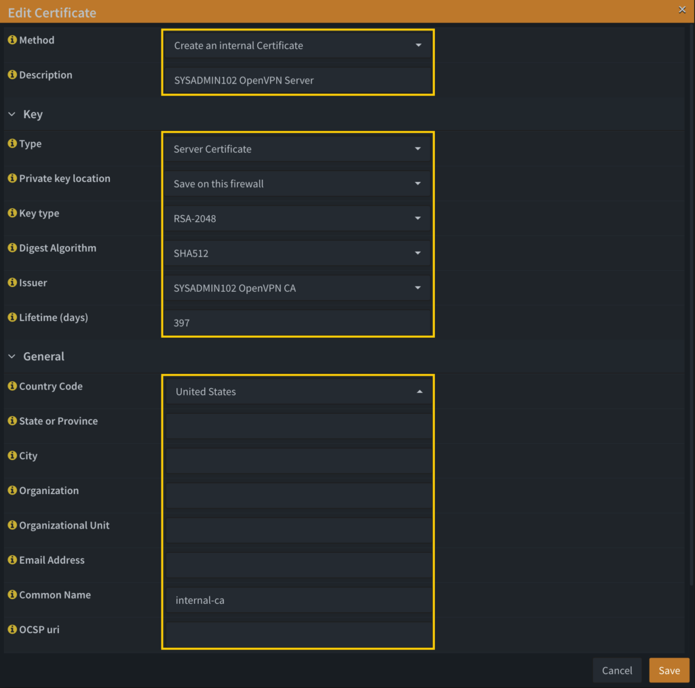](https://sysadmin102.com/wp-content/uploads/2024/03/Screenshot-2025-01-13-at-18.31.57.png)

**Step 3: Create a User and Add a User Certificate**

- If you have already created a user, to set up a new certificate authority, go to **System ‣ Access ‣ Users** and click **Edit** on the user to whom you want to add the certificate.

- Under **User Certificates**, click **Add**.

[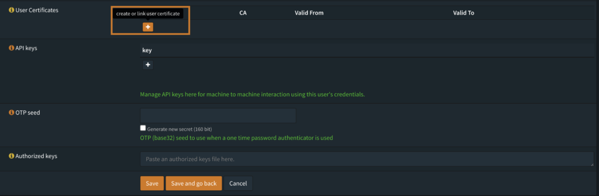](https://sysadmin102.com/wp-content/uploads/2024/02/Screenshot-2024-02-29-at-22.49.40.png)

- **Method**: Select Create an internal Certificate.
- **Description**: Enter a user name.
- **Type**: Client Certificate.
- **Private key location**: Select Save on this firewall or Download and do not save.
- **Key Type**: match the Key Type in step 1.
- **Digest Algorithm**: match the Digest Algorithm in step 1.
- **Issuer**: Certificate of Authority that you created in step 1.
- **Lifetime (days)**: input the appropriate number of days. Ex: 3650 (the equivalent of 10 years).
- If anything is not mentioned, leave blank or default values.
- Select **Save** when done.

**Step 4: Create Static Key**

- To create a Static Key, navigate to **VPN ‣ OpenVPN ‣ Instances ‣ Static Keys** and select **Add** (plus sign icon).

[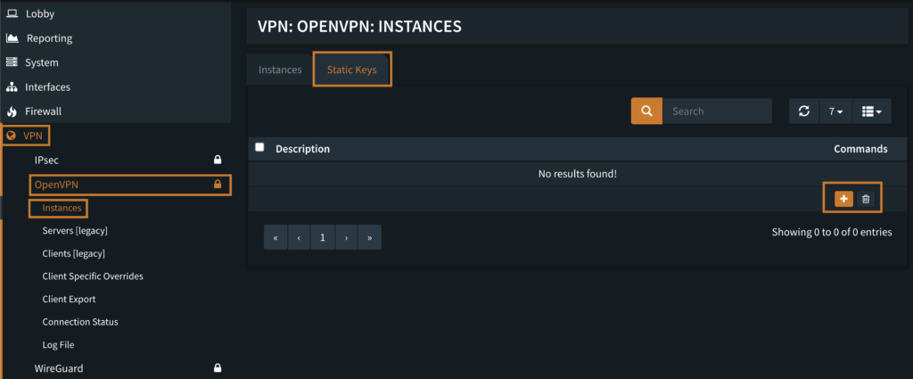](https://sysadmin102.com/wp-content/uploads/2024/02/Screenshot-2024-02-29-at-21.31.21.png)

- Create a unique description.
- Under **Mode**, select **crypt (Encrypt and authenticate all control channel packets)**.
- Select **Save** when finished.

[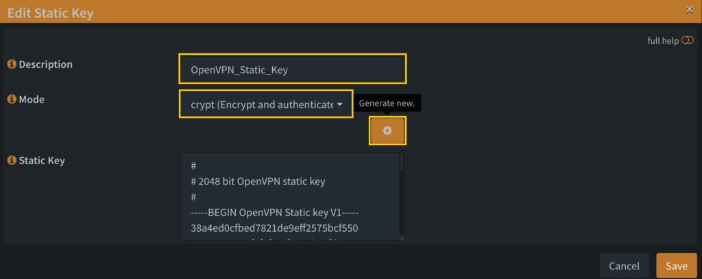](https://sysadmin102.com/wp-content/uploads/2024/03/Screenshot-2025-01-13-at-18.55.10.png)

**Step 5: Create an OpenVPN Instance**

- Create a new server instance via **VPN ‣ OpenVPN ‣ Instances**.

[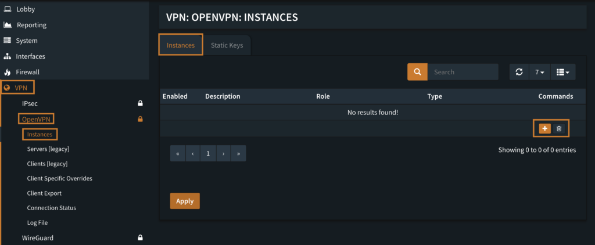](https://sysadmin102.com/wp-content/uploads/2024/02/Screenshot-2024-02-29-at-21.42.19.png)

[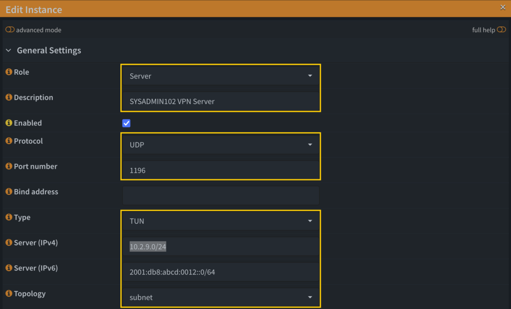](https://sysadmin102.com/wp-content/uploads/2024/03/Screenshot-2025-01-13-at-19.02.05.png)

- **Role**: Select Server.
- **Description**: Create a unique Description.
- **Protocol**:
    - UDP: better for VPN performance, and lower latency. Disadvantages: No built-in correction, potential for packet loss.
    - TCP: less detectable as VPN traffic, bypasses deep packet inspection, Mimics HTTPS traffic on port 443. Disadvantages: slower compared to UDP, possible double encryption issue.
- **Port number**. Note: _1194 is the default port for OpenVPN. However, I chose 1196 since another OpenVPN server has used port 1194._ If you use TCP, then use port 443.
- Type: TUN (layer 3 tunnel).
- **Server (IPv4)**: 10.2.9.0/24
- Use Class A or Class B addresses:
    - Class A Private Range: 10.0.0.0 to 10.255.255.255
    - Class C Private Range: 192.168.0.0 to 192.168.255.255
    - Choose a unique one
    - **==Avoid using common default router IP addresses such as 10.0.0.1/24 or 192.168.1.1/24. VPN won’t know how to route packets between multiple sites if those sites don’t use a subnet that uniquely identifies them.==**
- **Server (IPv6)**: 2001:db8:abcd:0012::0/64 (Optional)
- **Topology**: select **subnet**.

[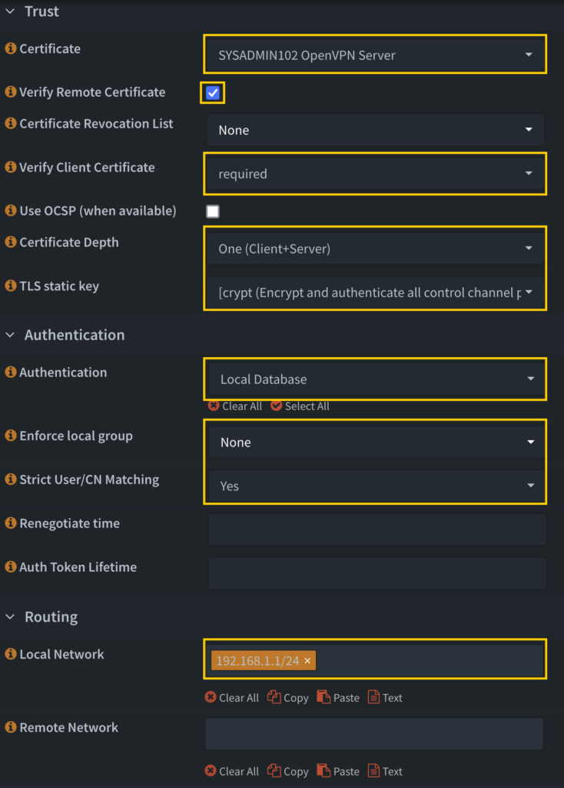](https://sysadmin102.com/wp-content/uploads/2024/03/Screenshot-2025-01-13-at-19.34.34.png)

- **Certificate**: Select the Server Certificate created in step 2.
- **Certificate Revocation List**: Optional.
- **Verify Remote Certificate**: Checked.
- **Verify Client Certificate**: select required.
- **Certificate Depth**: Select One (Client+Server).
- **TLS static key**: select the static key created in step 4.
- **Authentication**: Select the authentication method. Ex: Local Database or TOTP Server.
- **Enforce local group**: Optional.
- **Strict User/CN Matching**: Optional.
- Note: _==Selecting the “Strict User/CN Matching” option ensures that only a matching user/certificate can log in; this option needs to be deselected when sharing a single certificate between clients.==_
- **Local network**: Optional.
- **Remote Network**: Blank

[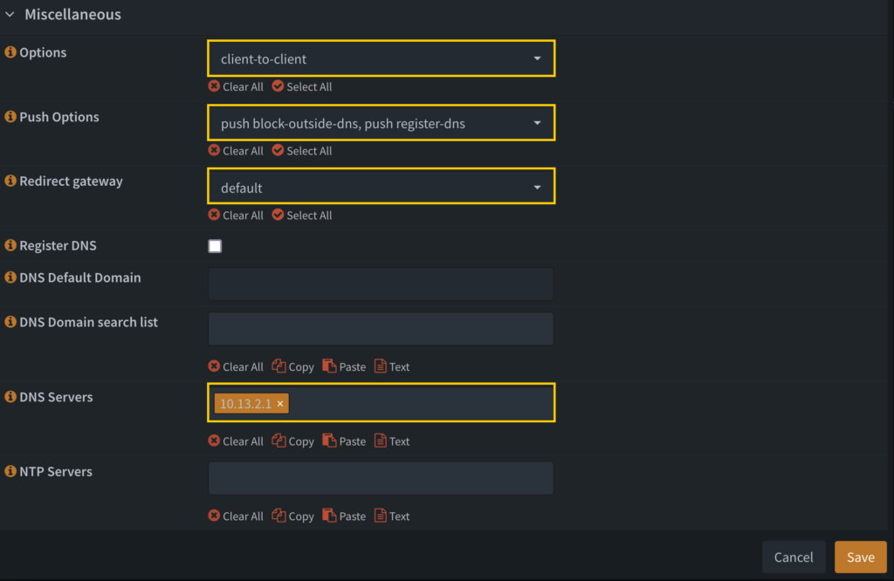](https://sysadmin102.com/wp-content/uploads/2024/03/Screenshot-2025-01-13-at-19.37.04.png)

- **Options**:
    - **client-to-client** if you would like connecting clients to be able to reach each other over the VPN. By default, clients will only be able to reach the server.
    - **duplicate-cn**: connections with same Common Name (CN) are allowed, so one cert can be used by more than one connection/users.
    - **passtos**: Set the TOS field of the tunnel packet to what the payload’s TOS is.
    - **persist-remote-ip**: Preserve most recently authenticated remote IP address and port number
    - **route-nopull**: accept options pushed by server EXCEPT for routes, block-outside-dns and dhcp options like DNS servers
    - **route-noexec**: don’t add or remove routes automatically.
    - **remote-random**: can be used to initially “scramble” the connection list
- **Push Options**:
    - **block-outside-dns**: Block DNS servers on other network adapters to prevent DNS leaks. This option prevents any application from accessing TCP or UDP port 53 except one inside the tunnel.
    - **register-dns**: Run ipconfig /flushdns and ipconfig /registerdns on connection initiation. This is known to kick Windows into recognizing pushed DNS servers.
- **Redirect gateway**:
    - **local**: Add the **local** flag if both OpenVPN servers are directly connected via a common subnet, such as with wireless.
    - **autolocal**: Try to automatically determine whether to enable **local** flag above.
    - **default**: Automatically execute routing commands to cause all outgoing IP traffic to be redirected over the VPN
    - **bypass-dhcp**: Add a direct route to the DHCP server (if it is non-local) which bypasses the tunnel (Available on Windows clients, may not be available on non-Windows clients).
    - **bypass-dns**: Add a direct route to the DNS server(s) (if they are non-local) which bypasses the tunnel (Available on Windows clients, may not be available on non-Windows clients).
    - **block-local**: Block access to local LAN when the tunnel is active, except for the LAN gateway itself. This is accomplished by routing the local LAN (except for the LAN gateway address) into the tunnel.
    - **ipv6 (default)**: Redirect IPv6 routing into the tunnel
    - **not ipv4 (default)**: Do not redirect IPv4 traffic – typically used in the flag pair **ipv6 !ipv4** to redirect IPv6-only.
- Register DNS: Optional.
- DNS Default Domain: Optional.
- DNS Servers: Enter your DNS server IP Address; if you do not have a DNS Server, use Quad9 DNS (9.9.9.9) or Cloudflare DNS (1.1.1.1).
- Select **Save** when finished.
- Don’t forget to select **Apply** when finished.

[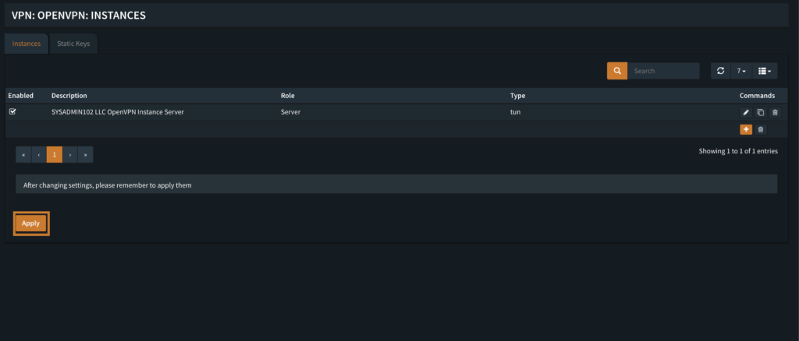](https://sysadmin102.com/wp-content/uploads/2024/02/Screenshot-2024-02-29-at-22.27.31.png)

**Step 6: Assign an interface to OpenVPN Server (required if not setting NAT rules)**

- Navigate to **Interfaces** ‣ **Assignments**
- Under **Device**: Select the OpenVPN Server you just created.
- Select **Add** when done.

[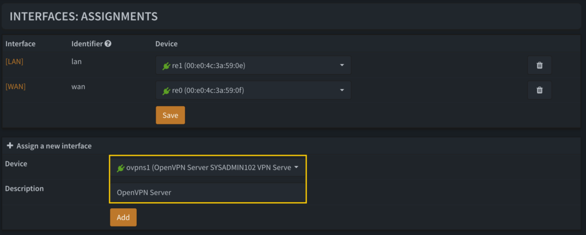](https://sysadmin102.com/wp-content/uploads/2024/03/Screenshot-2025-01-13-at-19.40.00.png)

- Navigate to **Interfaces** ‣ **SYSADMIN102VPNServer1190** (The interface you just created).
- Checked **Enable Interface** and **Prevent interface removal**.
- Select **Apply changes**.

[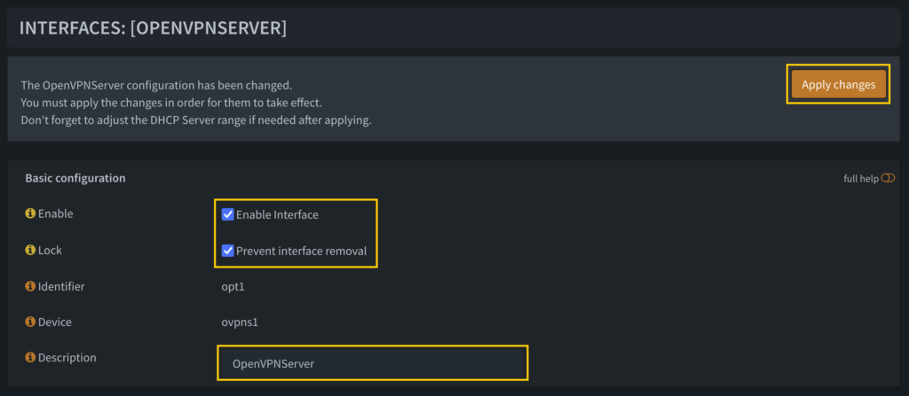](https://sysadmin102.com/wp-content/uploads/2024/03/Screenshot-2025-01-13-at-19.41.35.png)

**Step 7: Create Firewall rules**

1. The first rule will allow clients to connect to the OpenVPN server.

- Navigate to **Firewall ‣ Rules ‣ WAN** and add a rule to allow traffic on the port you selected in step 5 when creating an OpenVPN Instance.
- Click Add to add a new rule.

[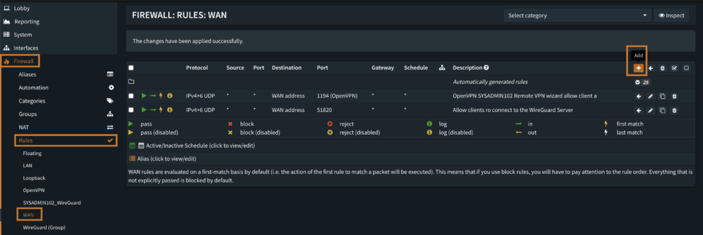](https://sysadmin102.com/wp-content/uploads/2024/02/Screenshot-2024-02-29-at-23.04.39.png)

- The firewall rule should be set as shown in the below screenshot.

[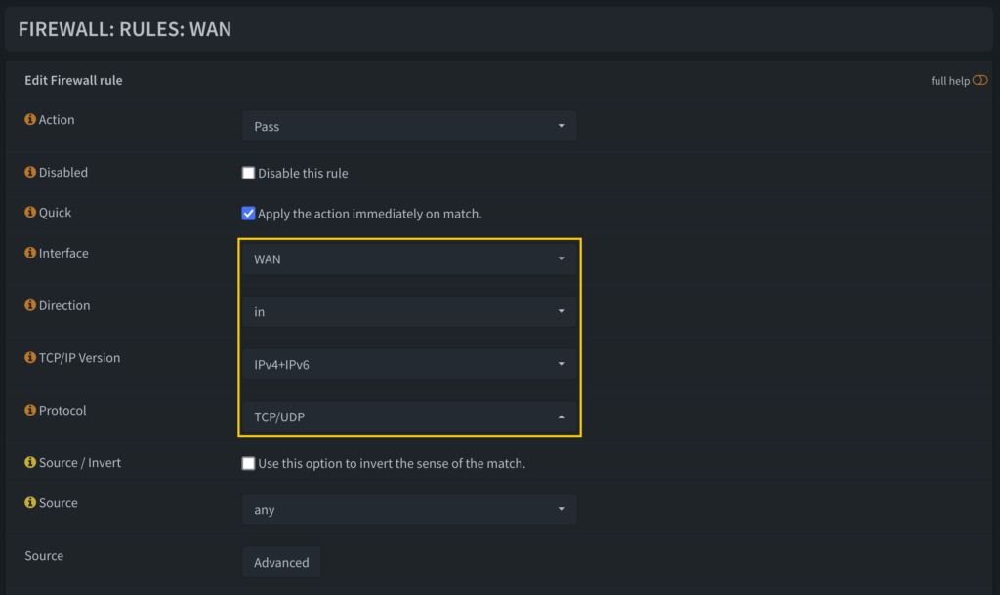](https://sysadmin102.com/wp-content/uploads/2024/03/Screenshot-2025-01-13-at-19.45.23.png)

- Select **OpenVPN** from the drop-down list if you use the default port 1194. Otherwise, select **(other)**, and specify the port number. Ex: 1190.
- Select **Save** when done.

[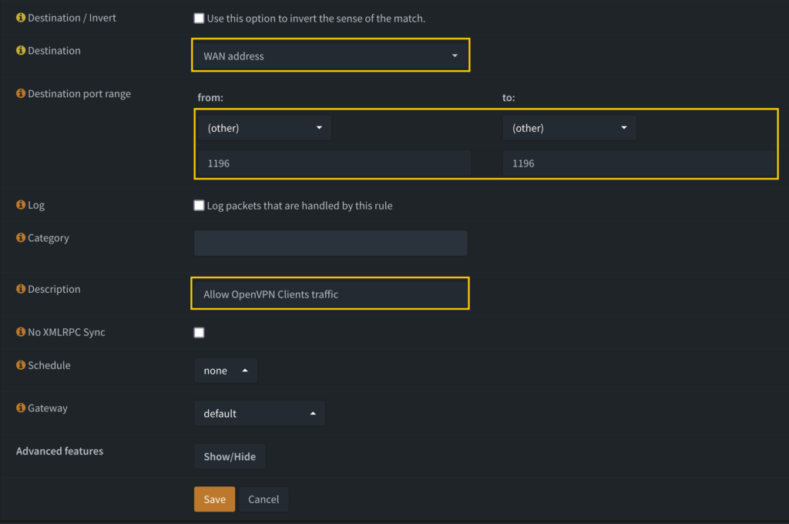](https://sysadmin102.com/wp-content/uploads/2024/03/Screenshot-2025-01-13-at-19.49.26.png)

- Select Apply changes.

[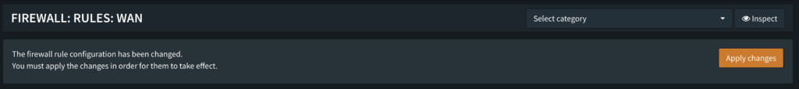](https://sysadmin102.com/wp-content/uploads/2024/02/Screenshot-2024-02-29-at-23.13.38.png)

2. The second rule is to allow clients access to whatever IPs they intend to access.

- Navigate to **Firewall ‣ Rules ‣ **OpenVPNServer** (Interface you just created);** for this example, we keep it simple and add one to allow all.
- Select **Add** New rule.
- Destination: _Specify the IPs that client peers should be able to access, eg. “any” or specific IPs/subnets_

[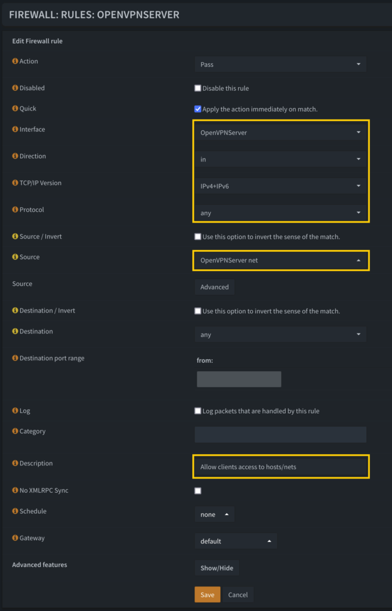](https://sysadmin102.com/wp-content/uploads/2024/03/Screenshot-2025-01-13-at-19.55.02.png)

- Select **Apply changes** when done.

[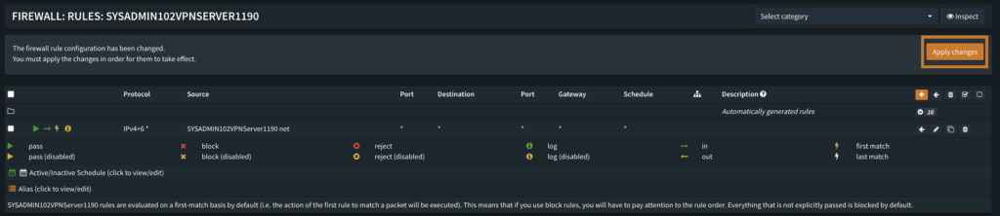](https://sysadmin102.com/wp-content/uploads/2024/03/Screenshot-2024-03-05-at-18.42.33.png)

**Step 8: Client Export**

- Navigate to **VPN ‣ OpenVPN ‣ Client Export** and export a profile for the remote client.
- Remote Access Server: Select the server created in step 5.
- Export type: Select **File Only**.
- Hostname: Enter your DDNS Fully Qualified Domain Name (FQDN) or Static Public IP Address.
- Port: same as the one selected in step 5.
- Select the Cloud icon to download the Client Certificate.

[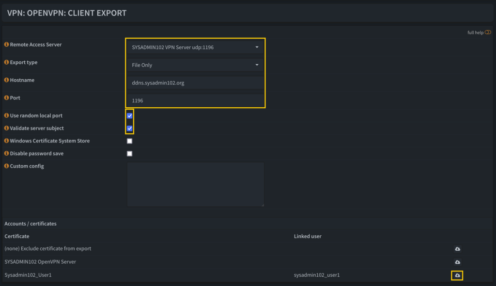](https://sysadmin102.com/wp-content/uploads/2024/03/Screenshot-2025-01-13-at-19.58.34.png)

**Ways to support my channel**

**==If you think this tutorial is helpful, please support my channel by subscribing to my YouTube channel or using the affiliated links below ([Full Disclaimer](https://sysadmin102.com/disclaimer-ftc-affiliate-disclaimer/)). I will get a small commission from your purchase to grow my channel:==**  
🚀 NextDNS: [https://nextdns.io/?from=btsm4vsx](https://nextdns.io/?from=btsm4vsx)   
🚀 Things I used for my server: [https://amzn.to/3hudohP](https://amzn.to/3hudohP)  
🚀 Tools I used: [https://amzn.to/3uXaSUr](https://amzn.to/3uXaSUr)  
🚀 Devices I used: [https://amzn.to/3FYlfxk](https://amzn.to/3FYlfxk)  
🚀 Networking/Cybersecurity/Programming Books: [https://amzn.to/3HEYwb0](https://amzn.to/3HEYwb0)  
🚀 TrueNAS HBA SAS controller IT Mode from the Art of Server: [https://ebay.us/cBWEvJ](https://ebay.us/cBWEvJ)